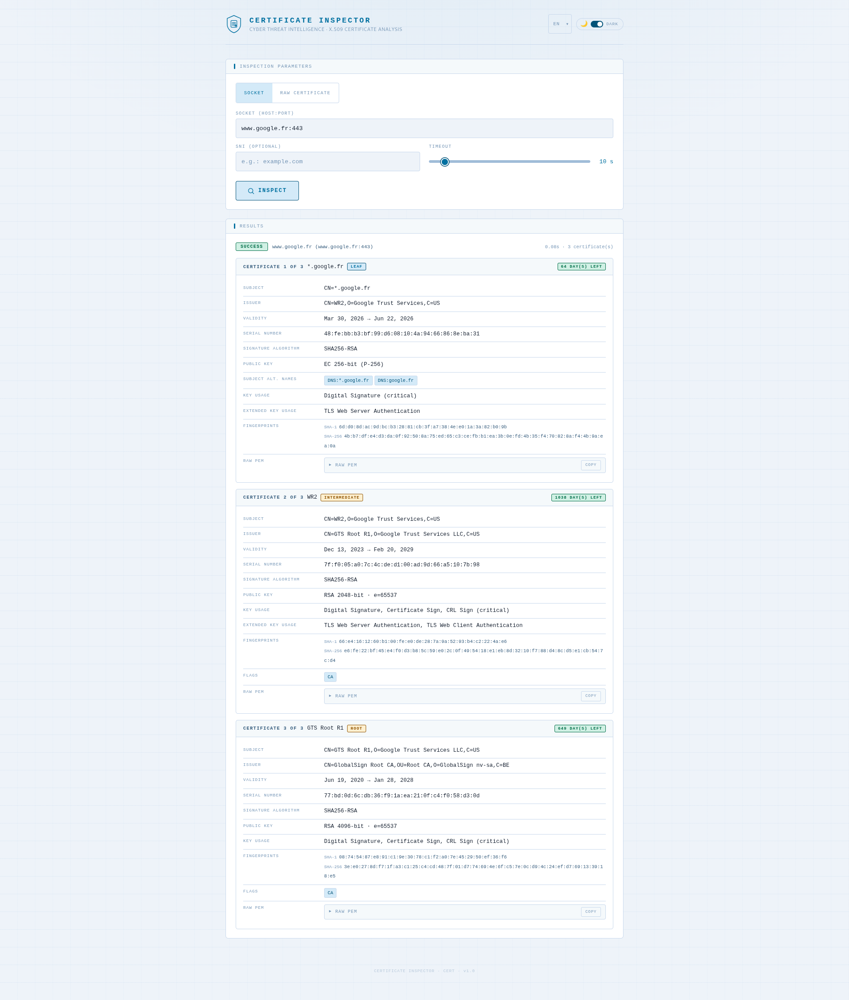

# http2cert

> **Certificate Inspector over HTTP** — A lightweight, stateless HTTP gateway that exposes X.509 certificate inspection as a JSON REST API.

Built in Go, it accepts a `POST` request with either a live TLS socket address or raw certificate bytes (PEM or DER), and returns the full parsed certificate chain as structured JSON. The binary embeds a static web UI and an OpenAPI specification, with zero runtime dependencies.

---

## Screenshot



> The embedded web UI (served at `/`) provides an interactive form to inspect TLS certificates directly from a hostname or by pasting raw PEM data. It supports **dark and light themes** and is fully translated into **15 languages**.

---

## Disclaimer

This project is released **as-is**, for demonstration or reference purposes.
It is **not maintained**: no bug fixes, dependency updates, or new features are planned. Issues and pull requests will not be addressed.

---

## License

This project is licensed under the **MIT License** — see the [`LICENSE`](LICENSE) file for details.

```
MIT License — Copyright (c) 2026 letstool
```

---

## Features

- Single static binary — no external runtime dependencies
- Embedded web UI and OpenAPI 3.1 specification (`/openapi.json`)
- Web UI available in **dark and light mode**, switchable at runtime via a toggle
- Web UI fully translated into **15 languages**: Arabic, Bengali, Chinese, German, English, Spanish, French, Hindi, Indonesian, Japanese, Korean, Portuguese, Russian, Urdu, Vietnamese
- Inspect certificates from a **live TLS connection** (dial by hostname/IP) or from **raw PEM/DER bytes**
- Auto-detection of PEM vs DER format; supports **single certificates and full chains**
- Full X.509 v3 extension parsing: SAN, Key Usage, Extended Key Usage, Basic Constraints, AKI/SKI, AIA, CRL, Certificate Policies, Name Constraints, OCSP No-Check, SCT list
- Per-certificate fingerprints: **SHA-1, SHA-256, SHA-512**
- Public key details for **RSA, EC, Ed25519, DSA, X25519/ECDH**
- Expiry status and days-left computed at query time
- Self-signed and CA flag detection
- Configurable listen address and dial timeout
- Docker image built on `scratch` — minimal attack surface

---

## Build

### Prerequisites

- [Go](https://go.dev/dl/) **1.22+**

### Native binary (Linux)

```bash
bash scripts/linux_build.sh
```

The binary is output to `./out/http2cert`.

The script produces a **fully static binary** (no libc dependency):

```bash
go build \
    -trimpath \
    -ldflags="-extldflags -static -s -w" \
    -tags netgo \
    -o ./out/http2cert ./cmd/http2cert
```

### Windows

```cmd
scripts\windows_build.cmd
```

### Docker image

```bash
bash scripts/docker_build.sh
```

This runs a two-stage Docker build:

1. **Builder** — `golang:1.24-alpine` compiles a static binary
2. **Runtime** — `scratch` image, containing only the binary

The resulting image is tagged `letstool/http2cert:latest`.

---

## Run

### Native (Linux)

```bash
bash scripts/linux_run.sh
```

This sets `LISTEN_ADDR=0.0.0.0:8080` and runs the binary.

### Windows

```cmd
scripts\windows_run.cmd
```

### Docker

```bash
bash scripts/docker_run.sh
```

Equivalent to:

```bash
docker run -it --rm -p 8080:8080 -e LISTEN_ADDR=0.0.0.0:8080 letstool/http2cert:latest
```

Once running, the service is available at [http://localhost:8080](http://localhost:8080).

---

## Configuration

Each setting can be provided as a CLI flag or an environment variable. The CLI flag always takes priority. Resolution order: **CLI flag -> environment variable -> default**.

| CLI flag    | Environment variable | Default           | Description                                                                    |
|-------------|----------------------|-------------------|--------------------------------------------------------------------------------|
| `-addr`     | `LISTEN_ADDR`        | `127.0.0.1:8080`  | Address and port the HTTP server listens on.                                   |
| `-timeout`  | `DIAL_TIMEOUT`       | `10s`             | TLS dial+handshake timeout. Go duration format: `5s`, `1m`, `1m30s`. Applied per request when no per-request timeout is provided. |
| `-json`     | `LOG_JSON`           | `false`           | Emit structured JSON logs instead of plain text. Accepts `true`/`false`/`1`/`0`. |

**Examples:**

```bash
# Using CLI flags
./out/http2cert -addr 0.0.0.0:9090 -timeout 30s -json true

# Using environment variables
LISTEN_ADDR=0.0.0.0:9090 DIAL_TIMEOUT=30s LOG_JSON=true ./out/http2cert
```

---

## API Reference

### `POST /api/v1/certinfo`

Inspects an X.509 certificate or certificate chain. Exactly one of `socket` or `raw_cert_data` must be provided.

#### Request body

**Option A — live TLS socket:**

```json
{
  "socket": "example.com:443",
  "sni": "example.com",
  "timeout": 10
}
```

**Option B — raw certificate data (PEM or DER):**

```json
{
  "raw_cert_data": "-----BEGIN CERTIFICATE-----\n...\n-----END CERTIFICATE-----"
}
```

| Field          | Type      | Required | Description                                                                                           |
|----------------|-----------|----------|-------------------------------------------------------------------------------------------------------|
| `socket`       | `string`  | (A)      | Address to dial: `domain:port`, `IPv4:port`, or `[IPv6]:port`. Example: `example.com:443`.           |
| `sni`          | `string`  | No       | Server Name Indication override. Defaults to the host part of `socket`.                               |
| `timeout`      | `integer` | No       | Per-request dial+handshake timeout in seconds (range: `1-120`). Socket mode only.                    |
| `raw_cert_data`| `string`  | (B)      | PEM or DER bytes. Auto-detected. Accepts single certificates and full PEM chains.                     |

> `socket` and `raw_cert_data` are mutually exclusive. `timeout` cannot be used with `raw_cert_data`.

#### Response body

```json
{
  "result": "SUCCESS",
  "source": {
    "type": "SOCKET",
    "address": "93.184.216.34:443",
    "sni": "example.com",
    "timeout": 10,
    "cert_count": 2
  },
  "answers": [
    {
      "format": "PEM",
      "version": 3,
      "serial_number": "0a:1b:2c:...",
      "signature_algorithm": "SHA256-RSA",
      "subject": { "common_name": "example.com", "organization": ["Example Org"], ... },
      "issuer": { "common_name": "DigiCert TLS RSA SHA256 2020 CA1", ... },
      "validity": {
        "not_before": "2024-01-01T00:00:00Z",
        "not_after": "2025-01-01T00:00:00Z",
        "is_expired": false,
        "days_left": 183
      },
      "public_key_info": { "algorithm": "RSA", "key_size_bits": 2048, "exponent": 65537 },
      "fingerprints": {
        "sha1":   "aa:bb:cc:...",
        "sha256": "11:22:33:...",
        "sha512": "ff:ee:dd:..."
      },
      "is_self_signed": false,
      "is_ca": false,
      "extensions": { ... }
    }
  ]
}
```

#### `source` object

| Field        | Type      | Description                                              |
|--------------|-----------|----------------------------------------------------------|
| `type`       | `string`  | `SOCKET` or `RAW`                                        |
| `address`    | `string`  | Resolved `host:port` dialed (SOCKET only)                |
| `sni`        | `string`  | SNI sent in the ClientHello (SOCKET only)                |
| `timeout`    | `integer` | Effective timeout applied in seconds (SOCKET only)       |
| `format`     | `string`  | `PEM` or `DER` (RAW only)                                |
| `cert_count` | `integer` | Number of certificates in `answers`                      |

#### `answers` — each certificate entry

| Field                  | Type     | Description                                              |
|------------------------|----------|----------------------------------------------------------|
| `raw`                  | `string` | PEM-encoded certificate                                  |
| `format`               | `string` | Input format: `PEM` or `DER`                             |
| `version`              | `int`    | X.509 version (1, 2, or 3)                               |
| `serial_number`        | `string` | Hex-encoded serial number (colon-separated)              |
| `serial_number_dec`    | `string` | Decimal serial number                                    |
| `signature_algorithm`  | `string` | e.g. `SHA256-RSA`, `ECDSA-SHA384`                        |
| `issuer`               | `object` | Parsed issuer Distinguished Name                         |
| `subject`              | `object` | Parsed subject Distinguished Name                        |
| `validity`             | `object` | Validity window with expiry status and days remaining    |
| `public_key_info`      | `object` | Algorithm, key size, curve (EC), exponent (RSA)          |
| `extensions`           | `object` | Parsed X.509 v3 extensions (omitted if none)             |
| `signature`            | `object` | Signature algorithm and raw hex value                    |
| `fingerprints`         | `object` | SHA-1, SHA-256, SHA-512 digests of the DER certificate   |
| `is_self_signed`       | `bool`   | `true` if subject == issuer and signature self-validates |
| `is_ca`                | `bool`   | `true` if Basic Constraints marks this as a CA           |

#### Result codes

| Value             | HTTP status | Meaning                                                               |
|-------------------|-------------|-----------------------------------------------------------------------|
| `SUCCESS`         | 200         | At least one certificate was parsed and returned                      |
| `INVALID_INPUT`   | 400         | Malformed request (bad JSON, missing/conflicting fields, bad timeout) |
| `NOTFOUND`        | 502         | Host unreachable (DNS failure, connection refused, timeout)           |
| `TLS_ERROR`       | 502         | TCP connected but TLS handshake failed                                |
| `NO_CERTIFICATES` | 200         | Connection or parse succeeded but the server returned no certificates |
| `ERROR`           | 500/502     | Internal or unexpected error                                          |

---

#### Example — inspect a live TLS certificate

```bash
curl -s -X POST http://localhost:8080/api/v1/certinfo \
  -H "Content-Type: application/json" \
  -d '{"socket": "example.com:443"}' | jq .
```

```json
{
  "result": "SUCCESS",
  "source": {
    "type": "SOCKET",
    "address": "93.184.216.34:443",
    "sni": "example.com",
    "timeout": 10,
    "cert_count": 2
  },
  "answers": [
    {
      "format": "PEM",
      "version": 3,
      "serial_number": "0a:1b:2c:3d:...",
      "signature_algorithm": "SHA256-RSA",
      "subject": { "common_name": "example.com" },
      "issuer": { "common_name": "DigiCert TLS RSA SHA256 2020 CA1" },
      "validity": {
        "not_before": "2024-01-15T00:00:00Z",
        "not_after": "2025-01-15T23:59:59Z",
        "is_expired": false,
        "days_left": 183
      },
      "fingerprints": {
        "sha256": "11:22:33:44:55:66:77:88:..."
      },
      "is_self_signed": false,
      "is_ca": false
    }
  ]
}
```

#### Example — inspect a raw PEM certificate

```bash
curl -s -X POST http://localhost:8080/api/v1/certinfo \
  -H "Content-Type: application/json" \
  -d "{\"raw_cert_data\": \"$(cat cert.pem)\"}" | jq .
```

---

### `GET /`

Returns the embedded interactive web UI.

### `GET /openapi.json`

Returns the full OpenAPI 3.1 specification of the API.

### `GET /favicon.png`

Returns the application icon.

---

## Development

Dependencies are managed with Go modules. After cloning:

```bash
go mod download
go build ./...
```

The test suite and initialization scripts are located in `scripts/`:

```
scripts/000_init.sh     # Environment setup (go mod tidy)
scripts/999_test.sh     # Integration test (curl against a running server)
```

Run unit tests:

```bash
go test ./...
```

---

## AI-Assisted Development

This project was developed with the assistance of **[Claude Sonnet 4.6](https://www.anthropic.com/claude)** by Anthropic.
